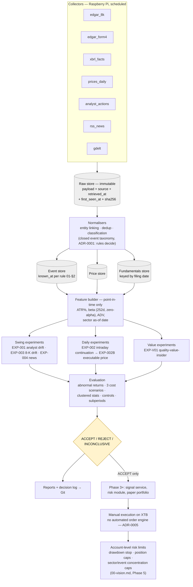
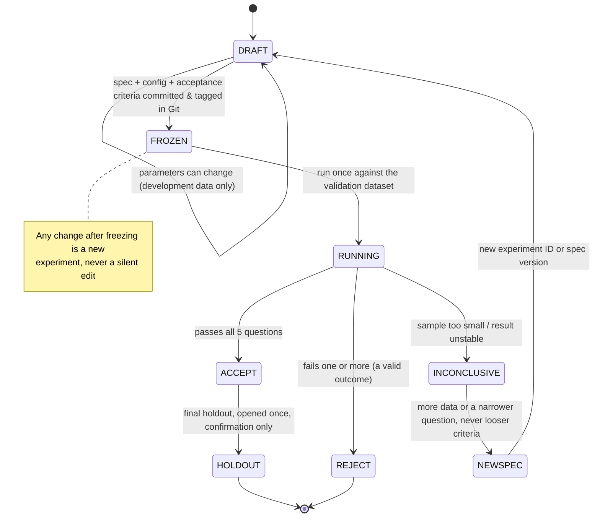

# 03 — Architecture

## Overview

```text
 COLLECTORS (Pi, scheduled)
 ├── edgar_8k      ├── edgar_form4     ├── xbrl_facts
 ├── prices_daily  ├── analyst_actions ├── rss_news   └── gdelt
                          │
                          ▼
 RAW STORE (immutable)  payload + source + retrieved_at + first_seen_at + sha256
                          │
                          ▼
 NORMALISERS  →  entity linking (CIK/ticker)  →  dedup  →  classification
                          │
                          ▼
 EVENT STORE  +  PRICE STORE  +  FUNDAMENTALS STORE   (all with known_at)
                          │
                          ▼
 FEATURE BUILDER (point-in-time: ATR%, beta, ADV, sector as-of date)
                          │
        ┌─────────────────┼─────────────────┐
        ▼                 ▼                 ▼
    SWING exps        DAILY exps        VALUE exps
        └─────────────────┼─────────────────┘
                          ▼
 EVALUATION  (abnormal returns, costs, clustering, controls)
                          │
                          ▼
 REPORTS + DECISION LOG  →  Git
```

From Phase 3 onward, a **signal service**, a **risk module** and a **paper portfolio** sit after the experiments. There is no execution engine ([ADR-0005](adr/0005-manual-execution-xtb.md)).

## Diagrams

Rendered images: [pipeline.png](diagrams/pipeline.png), [lifecycle.png](diagrams/lifecycle.png). Source below (GitHub/GitLab render these Mermaid blocks natively; edit the source, not the PNGs — the PNGs are a convenience snapshot, not the source of truth).

### Data & experiment pipeline



### Experiment lifecycle



## Components

| Component | Responsibility | Runs on |
|---|---|---|
| Collectors | Download, stamp times, write raw snapshots. No transformation. | Pi |
| Normalisers | Parse raw payloads into typed records; entity linking; dedup | Pi |
| Classifier | Map text to the closed event taxonomy (rules → FinBERT → optional LLM) | Pi (+ API) |
| Feature builder | Point-in-time features | Pi / laptop |
| Experiment runner | Execute a frozen spec against a data snapshot | Laptop (Pi for light daily-data runs) |
| Evaluator | Metrics, costs, statistics, controls | Laptop |
| Reporter | Markdown reports, decision log entries | Pi / laptop |

## Closed event taxonomy (V1)

```text
POSITIVE / NEGATIVE / NEUTRAL / UNKNOWN
  × type:
    earnings_release            (8-K 2.02)
    material_agreement          (8-K 1.01)
    acquisition_disposition     (8-K 2.01)
    analyst_upgrade | analyst_downgrade
    analyst_target_raise | analyst_target_cut
    insider_purchase | insider_sale   (Form 4)
    other_verified
```

Direction for 8-K events is not inferred from text in V1; experiments use the market reaction (gap sign) instead.

## Core data model

| Table | Key fields |
|---|---|
| `raw_snapshot` | `id`, `source`, `url`, `retrieved_at`, `first_seen_at`, `sha256`, `payload_path` |
| `security` | `security_id`, `cik`, `ticker`, `name`, `valid_from`, `valid_to`, `delisted` |
| `sector_history` | `security_id`, `sector`, `valid_from`, `valid_to` |
| `price_daily` | `security_id`, `date`, `open`, `high`, `low`, `close`, `adj_close`, `volume`, `snapshot_id` |
| `event` | `event_id`, `security_id`, `type`, `direction`, `published_at`, `first_seen_at`, `known_at`, `session_date`, `source`, `source_id`, `snapshot_id`, `classifier_version` |
| `fundamental` | `security_id`, `tag`, `period_end`, `value`, `filed`, `snapshot_id` |
| `experiment_run` | `run_id`, `experiment_id`, `spec_version`, `config_hash`, `code_commit`, `data_snapshot_ids`, `started_at` |
| `observation` | `run_id`, `event_id`, `status` (ACCEPTED/REJECTED), `rejection_reason`, features, returns, abnormal returns |

Storage: SQLite for operational state, Parquet + DuckDB for research ([ADR-0003](adr/0003-sqlite-duckdb-over-postgres.md)).

## Decision log

Two forms of every decision: one human-readable line and one JSON record.

```text
2026-10-05 ACME | SWING | EXP-003 | ENTER-PAPER | 8-K 2.02 pre-market, gap +4.1% (0.8 ATR) | exit 2026-10-19 close
2026-10-05 XYZ  | SWING | EXP-003 | REJECT      | gap 0.4 ATR below threshold
```

```json
{
  "date": "2026-10-05",
  "ticker": "ACME",
  "strategy": "swing",
  "experiment": "EXP-003",
  "action": "enter_paper",
  "reason": "8k_2.02_premarket_gap",
  "spec_version": "1.0.0",
  "config_hash": "…",
  "code_commit": "…",
  "event_ids": ["…"],
  "model_version": null
}
```

Rejected candidates are logged too. Near misses are how future experiments are proposed.

## Signal lifecycle (Phase 3+)

```text
WATCH → TRIGGERED → ENTERED → EXITED → COOLDOWN
   └────→ REJECTED (with reason)
```

In research phases exits are fixed-horizon. Trailing stops, partial exits and catalyst-decay rules are later experiments.

## Planned repository layout

```text
edge-lab/
  docs/                 this documentation
  config/               frozen experiment configs (YAML), risk limits
  src/edgelab/
    collectors/  normalise/  features/  experiments/  evaluate/  report/
  tests/                incl. look-ahead tests on synthetic data
  reports/              generated markdown reports (committed)
  decisions/            decision log (committed)
  deploy/               systemd units, timers, setup scripts
```
