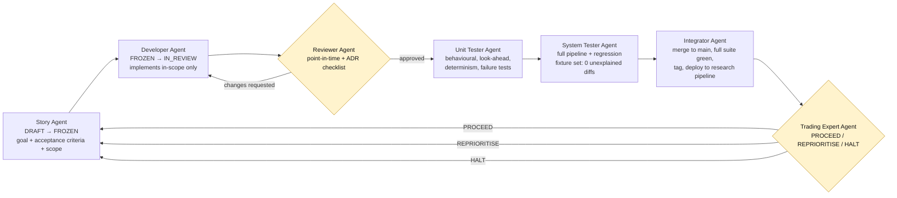
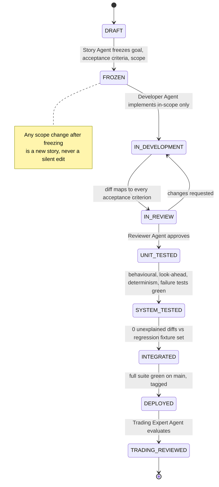

# 07 — Development workflow: agents and feature lifecycle

## Scope

This document defines how software gets built for edge-lab (collectors, normalisers, feature builder, experiment runner, evaluator, and later the Phase 3+ signal service, risk module and paper portfolio). It does not change how trading decisions get made: [ADR-0001](adr/0001-no-llm-in-decision-path.md) still holds — no LLM decides an entry, exit or size at runtime. What changes here is *how the deterministic, versioned rules that ADR-0001 requires actually get written, reviewed and shipped*. An agent writing code that implements a frozen rule is not the same thing as an agent making a trading decision; this document is only about the former.

"Production" in this document means the research pipeline is live and running (Phase 1+: collectors on the Pi, raw snapshots accumulating, experiments computable) — not live trading capital. Live capital is gated separately, behind Phase 5 and the account-level risk limits in [00-vision.md](00-vision.md#account-level-risk-limits-phase-5). A feature can reach "production" under this workflow long before any money is at risk.

All code is written, reviewed, tested and merged in this repository — on the laptop or in a Claude Code / Cowork session, never directly on the Pi. The Pi only ever pulls an already-tagged, already-tested release (`git pull` plus a service restart, per [04-infrastructure.md](04-infrastructure.md)); it is a deployment target, not a development environment. This is what the [Integrator Agent](agents/integrator-agent.md) and [Orchestrator Agent](agents/orchestrator-agent.md) enforce: nothing reaches the Pi that hasn't already gone through every gate in this repository first.

## Repository layout

Code and tests each have one obvious home, so a Developer Agent never
has to guess where a new module or test belongs, and a Reviewer Agent
can check "is this in the right place" mechanically.

**`src/edgelab/<layer>/`** — one subpackage per pipeline layer, named
after the layer it implements in the [architecture
diagram](03-architecture.md#diagrams):

- `storage/` — the immutable raw store and the downstream event/price/
  fundamentals stores (`storage/raw_snapshot.py` is STORY-001).
- `collectors/` — one module per source in
  [02-data-sources.md](02-data-sources.md) (`collectors/edgar_8k.py`,
  `collectors/prices_daily.py`, ...).
- `normalisers/` — entity linking, dedup, event classification.
- `calendar/` — trading-day/session-date resolution (holidays, half-days, DST) — a shared dependency of normalisers and the feature builder, not owned by either (added for STORY-005).
- `features/` — point-in-time feature builder (ATR%, beta, ADV, ...).
- `experiments/` — experiment runner and evaluation code shared across
  Swing/Daily/Value (not the experiment *specs* themselves, which stay
  in `docs/experiments/` as frozen documents).
- `audit/` — analysis harnesses over already-collected data that gate
  whether a source/strategy may proceed (e.g. Gate 0's feed-latency
  audit, STORY-007) — distinct from `experiments/`, which tests a
  trading hypothesis; `audit/` tests whether the *data* is trustworthy
  enough to test one.
- Later, Phase 3+ only: `signal/`, `risk/`, `portfolio/`.

A story that doesn't fit an existing layer is a signal to add a new
subpackage, named after the layer, not to drop a module into an
unrelated one.

**`tests/`** — mirrors `src/edgelab/` by *test kind*, not by module,
because the three kinds are checked by different gates
(see [Gate criteria](#gate-criteria) below):

- `tests/unit/` — one file per module under test (`tests/unit/
  test_raw_snapshot.py` tests `src/edgelab/storage/raw_snapshot.py`).
  Isolated, fast, no cross-module wiring. Owned by the [Unit Tester
  Agent](agents/unit-tester-agent.md).
- `tests/system/` — multi-module, end-to-end-within-the-repo
  scenarios (e.g. several collector runs writing into one shared
  store, then read back). Owned by the [System Tester
  Agent](agents/system-tester-agent.md).
- `tests/regression/` — one fixture per `FROZEN` experiment, used by
  the Integrator Agent's "0 regressions" gate (see [Definition of "0
  regressions"](#definition-of-0-regressions) below). Empty until the
  first experiment freezes; a story that predates any `FROZEN`
  experiment satisfies this gate vacuously, and its system test says
  so explicitly rather than skipping the check silently.

`pytest.ini` at the repo root sets `pythonpath = src` so
`src/edgelab/...` is importable without an install step, and
`testpaths = tests` so `python3 -m pytest` (not a bare `pytest` —
its console-script entry point may not be on `PATH`) picks up all
three kinds by default.

## Principle: reuse the experiment lifecycle for stories

[05-experiment-protocol.md](05-experiment-protocol.md) already established a discipline that works: `DRAFT → FROZEN → RUNNING → ACCEPT/REJECT/INCONCLUSIVE`, where freezing before results exist prevents unconsciously optimising toward an outcome. A feature story gets the same treatment, for the same reason: a developer who can quietly renegotiate scope mid-build is exactly as dangerous as an experiment spec that can be edited after seeing results.

```text
DRAFT → FROZEN → IN_DEVELOPMENT → IN_REVIEW → UNIT_TESTED → SYSTEM_TESTED → INTEGRATED → DEPLOYED → TRADING_REVIEWED
```

Any change of scope after FROZEN is a new story (new ID or spec version), never a silent edit — identical to the experiment rule.

## Roles

Seven roles, one per stage. Each has its own spec in [docs/agents/](agents/):

| Role | Owns the gate into | Spec |
|---|---|---|
| Story Agent | FROZEN | [story-agent.md](agents/story-agent.md) |
| Developer Agent | IN_REVIEW | [developer-agent.md](agents/developer-agent.md) |
| Reviewer Agent | UNIT_TESTED | [reviewer-agent.md](agents/reviewer-agent.md) |
| Unit Tester Agent | SYSTEM_TESTED | [unit-tester-agent.md](agents/unit-tester-agent.md) |
| System Tester Agent | INTEGRATED | [system-tester-agent.md](agents/system-tester-agent.md) |
| Integrator Agent | DEPLOYED | [integrator-agent.md](agents/integrator-agent.md) |
| Trading Expert Agent | next story's DRAFT (or a backlog revision) | [trading-expert-agent.md](agents/trading-expert-agent.md) |

One agent, one gate. A gate owner never also approves its own output at the next gate — the developer doesn't review their own code, the reviewer doesn't write the unit tests. This is the same separation the research protocol already relies on between hypothesis, freeze and evaluation.

Each role is also wired up as an invocable Claude Code subagent in [`.claude/agents/`](../.claude/agents/) (e.g. `story-agent`, `reviewer-agent`), with tool access scoped to match its non-goals — the Reviewer and Trading Expert agents have no Write/Bash access, so they structurally cannot "just fix it" themselves instead of flagging it. Each subagent file is a thin wrapper that points back to its spec in `docs/agents/` as the single source of truth, so the two never drift out of sync.

## Orchestration

Invoking all seven roles by hand for every story defeats the point of defining a pipeline. An eighth role, the **Orchestrator Agent** ([spec](agents/orchestrator-agent.md), [subagent](../.claude/agents/orchestrator.md), name `edge-lab-orchestrator`), runs the full gate sequence for one story from a single request — "start system implementation," "implement the next story," or similar.

What it does: picks the next story (the first in-flight one in `stories/`, or the next item in the [MVP sequence](#suggested-mvp-story-sequence-phase-1) if nothing is in flight), walks it through every gate in order, loops Developer → Reviewer up to three times on review feedback before stopping to report, and stops immediately on a Trading Expert HALT regardless of how far into a longer run it is.

What it does not do: skip a gate, or reach the physical Raspberry Pi described in [04-infrastructure.md](04-infrastructure.md) unless that machine is directly reachable from wherever the orchestrator itself is running (a Claude Code session on the Pi, or on a laptop with SSH access to it — not this remote session by default). Short of that, "deploy" means merged, tagged and ready in the repository, not actually rolled out; the orchestrator says so explicitly rather than claiming a live deploy that didn't happen.

Default cadence: one story per request, stopping after that story's Trading Expert evaluation to report PROCEED / REPRIORITISE / HALT and ask before continuing. It only chains through the MVP sequence unattended if explicitly asked to.

## Diagrams

Rendered images: [agent-workflow.png](diagrams/agent-workflow.png), [story-lifecycle.png](diagrams/story-lifecycle.png). Source below (edit the Mermaid, not the PNGs).

### Agent handoffs



### Story lifecycle



## Gate criteria

| Transition | Owner | Pass condition |
|---|---|---|
| DRAFT → FROZEN | Story Agent | Every acceptance-criteria item independently checkable; source item resolves to a real, currently-open item |
| FROZEN → IN_REVIEW | Developer Agent | Diff maps every acceptance-criteria item to the code that satisfies it; point-in-time checklist self-checked first |
| IN_REVIEW → UNIT_TESTED | Reviewer Agent | Every checklist item (point-in-time rules, ADRs, forbidden inputs, config separation) explicitly addressed |
| UNIT_TESTED → SYSTEM_TESTED | Unit Tester Agent | Behavioural + look-ahead + determinism + failure-handling tests all present and passing |
| SYSTEM_TESTED → INTEGRATED | System Tester Agent | Zero unexplained diffs against the regression fixture set (every FROZEN experiment re-run) |
| INTEGRATED → DEPLOYED | Integrator Agent | Full suite green on main (not just the branch); tagged release |
| DEPLOYED → TRADING_REVIEWED | Trading Expert Agent | Rubric answered: PROCEED / REPRIORITISE / HALT decided and committed before the next story leaves DRAFT |

## Definition of "0 regressions"

This reuses the reproducibility principle already stated in [00-vision.md](00-vision.md#principles) ("every result can be regenerated from immutable raw snapshots, a config hash and a code version") as the actual regression oracle, instead of inventing a separate one:

1. Every FROZEN experiment's last-accepted run recorded `data_snapshot_ids`, `config_hash` and `code_commit` in the `experiment_run` table ([03-architecture.md](03-architecture.md#core-data-model)).
2. Before any deploy, System Tester Agent re-runs every FROZEN experiment against the *same* `data_snapshot_ids` and `config_hash`, on the *new* code.
3. The new `observation` records must match the last-accepted ones exactly, field for field — unless the story's explicit, documented purpose was to change that experiment's behaviour, in which case the experiment itself gets a new spec version per [05-experiment-protocol.md](05-experiment-protocol.md), never a silent recalculation.
4. Any other diff is a regression and blocks INTEGRATED.

"0 regressions" is therefore a mechanical check against data already required to exist, not a new testing philosophy layered on top.

## Where stories come from

The backlog is not invented ad hoc. Every story traces to one of:

- An open item in [06-trading-system-audit-v1.md](06-trading-system-audit-v1.md)
- A phase exit criterion in [00-vision.md](00-vision.md#roadmap)
- A `Known limitations` line in an experiment spec

A story with no traceable source is rejected at Story Agent's own gate (see [story-agent.md](agents/story-agent.md)) — this keeps the backlog from drifting into scope no one asked for.

## Suggested MVP story sequence (Phase 1)

Given Phase 1's exit criterion ("Audit report: reconstructable-event rate and failure profile"), a defensible first sequence:

1. Raw snapshot store: write-only, immutable, SHA-256, for one source. ([STORY-001](../stories/STORY-001-raw-snapshot-store.md), DEPLOYED)
2. `edgar_8k` collector (the most defensible free source — official acceptance timestamps, no feed-latency ambiguity) writing into the raw store. ([STORY-002](../stories/STORY-002-edgar-8k-collector.md), DEPLOYED)
3. Normaliser + event store for 8-K 2.02/1.01, with `known_at` computed per [01-point-in-time-rules.md §2](01-point-in-time-rules.md). ([STORY-003](../stories/STORY-003-normaliser-event-store.md), DEPLOYED — `session_date` deliberately left `None`, backfilled by item 5 below)
4. `prices_daily` collector + price store (needed by every downstream feature). ([STORY-004](../stories/STORY-004-prices-daily-collector.md), DEPLOYED)
5. **Exchange-calendar integration** (added by the Trading Expert review after STORY-003, [06-trading-system-audit-v1.md](06-trading-system-audit-v1.md#story-003--8-k-normaliser-and-event-store-2026-09-25)): trading-day/session-date resolution, holidays, half-days, DST. Required before item 6, since both STORY-003's deferred `session_date` and item 6's rolling-window features need the same dependency; not required before item 4, which is why item 4 shipped first. ([STORY-005](../stories/STORY-005-exchange-calendar.md))
6. Feature builder: ATR%, beta, ADV — point-in-time only, per §5. Depends on item 5. (STORY-006)
7. Feed-latency audit harness (Gate 0 for [EXP-002](experiments/daily/EXP-002-intraday-continuation.md)). (STORY-007)
8. Pi collector entrypoint + deploy scaffold, Gate 0 scope: config loader, real HttpClient, scripts/collect_premarket_8k.py, systemd units + install/uninstall scripts. ([STORY-008](../stories/STORY-008-pi-collector-entrypoint.md), TRADING_REVIEWED)
9. Daily operations report artifact: per-day Markdown + JSON report over collection counts, cumulative Gate 0 latency, integrity spot-check, and collector failures. ([STORY-009](../stories/STORY-009-daily-ops-report.md), TRADING_REVIEWED)

This is a starting order, not a frozen backlog — Story Agent still freezes each one individually before development starts, and the Trading Expert Agent can reprioritise after any of them.

## Trading-expert review cadence

After each DEPLOYED story, the Trading Expert Agent evaluates the system state — this session's [external-review-brief.md](external-review-brief.md) and [06-trading-system-audit-v1.md](06-trading-system-audit-v1.md) are the first iteration of exactly this step, done manually before any code existed. This document formalises it into a repeatable gate instead of an occasional one-off. See [trading-expert-agent.md](agents/trading-expert-agent.md) for the full rubric.
